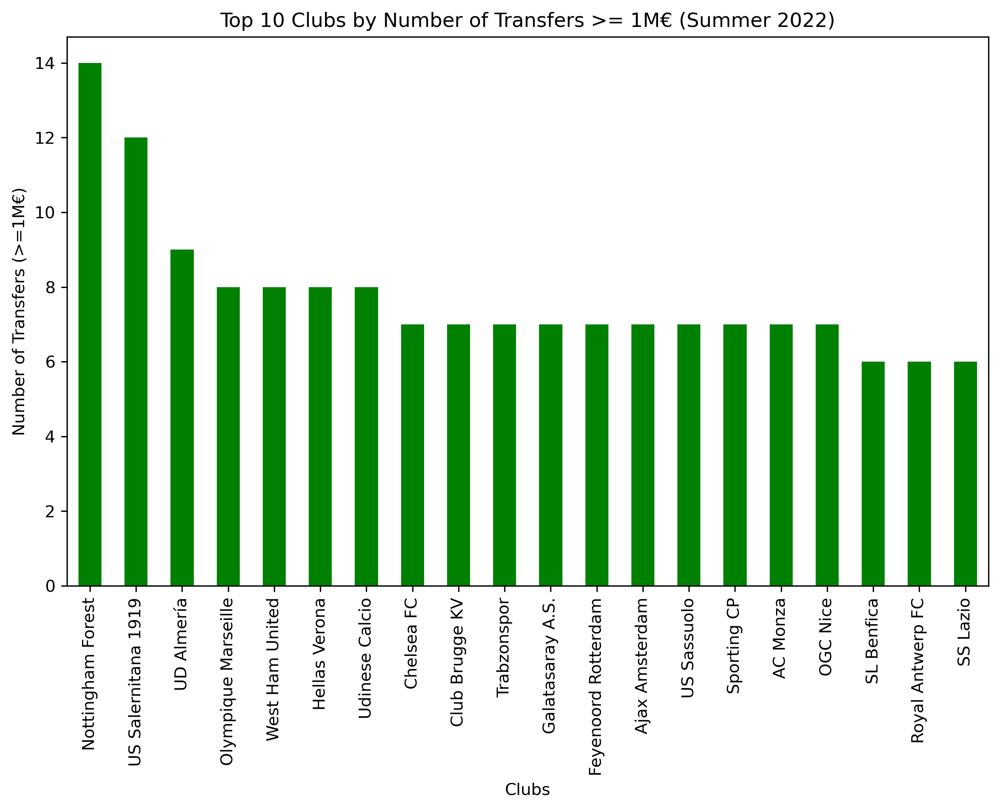

# 2022 Summer Transfer Window Analysis

This project analyzes the Summer 2022 football transfer window using Python (pandas, matplotlib).  
The dataset includes player names, clubs, leagues, transfer fees and more.

---

## Findings
- Chelsea FC was the top spending club (~279 m€).
- Premier League dominated all leagues with ~2220 m€ spent.
- Nottingham Forest made the most 1M+ transfers (14 players).
- Average transfer fee (all transfers): 0.25 m€.
- Average transfer fee (only 1M+ transfers): 7.4 m€.

---

## Visuals
### Top Spending Clubs

### Top Spending Leagues

### Distribution of Transfer Fees

### Average Fee Comparison

### Number of Transfers >=1M€ (by Clubs)

